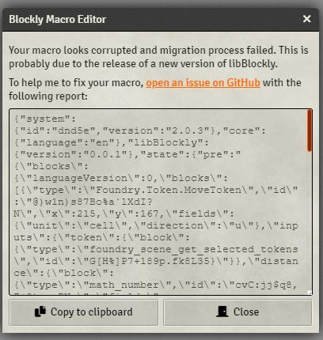

# Version 0.7.0

⚠️ This update is only available on Foundry v10+.

* add Macro validation and error report

You may have or will encounter issues with LibBlockly, espacially when updating to a newer version on this module because I still often tweak existing blocks to improve. Sometimes, thoses modifications can break your macro. To prevent this, a macro validation process has been implemented which will you to get some insigths corrupted macro issues :

Please [open a ticket on GitHub using providing link](https://github.com/MiahNelah/lib-blockly/issues) and copy/paste provided logs.

* add basic blocks migration

As stated before, blocks can be broken after updating libBlockly. I implemented a basic, first iteration of block migration which will convert your macro to the newest version silently. Conversion is done only on running or editing, and will not be persist until to change your macro.

* add new Token custom blocks
    * Get all tokens in scene ...
    * Get all tokens in current scene
    * Get selected token(s)
    * Toggle token(s) visibility
    * Show token(s)
    * Hide token(s)
    * Rotate token(s)
    * Set token(s) scale
    * Reset token(s) scale
    * Change token(s) elevation
    * Move token(s)
    * Toggle tokens(s) combat state (⚠️ work in progress ⚠️)

* a lot of underground work to ease custom block creation, fix multiples issues, remove useless warnings, etc.
